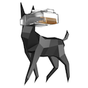

This repository contains specifications for the peer-to-peer networking protocols used by
Ethereum. The issue tracker here is for discussions of protocol changes. You can also get
in touch through our **[gitter channel](https://gitter.im/ethereum/devp2p)**.

### Implementations

devp2p is part of most Ethereum clients. Implementations include:

- [go-ethereum (Go)](https://github.com/ethereum/go-ethereum/)
- [Parity Ethereum (Rust)](https://github.com/paritytech/parity-ethereum)
- [Trinity (Python)](https://github.com/ethereum/py-evm)
- [Aleth (C++)](https://github.com/ethereum/aleth)
- [EthereumJ (Java)](https://github.com/ethereum/ethereumj)
- [EthereumJS (JavaScript)](https://github.com/ethereumjs/ethereumjs-devp2p)
- [ruby-devp2p (Ruby)](https://github.com/cryptape/ruby-devp2p)
- [Exthereum (Elixir)](https://github.com/exthereum/ex_wire)
- [eth_p2p (Nim)](https://github.com/status-im/nim-eth-p2p)
- [Nethermind (.NET)](https://github.com/tkstanczak/nethermind)
- [Ciri (Ruby)](https://github.com/ciri-ethereum/ciri)
- [Breadwallet (C)](https://github.com/breadwallet/breadwallet-core)

WireShark dissectors are [available here](https://github.com/ConsenSys/ethereum-dissectors).
