# Rationale for Admission-Control Parameter Choices

## 1. Objective

This report motivates the choice of parameter values for the registrar-side admission protocol used for topic advertisement registration. The admission protocol regulates access to a finite advertisement cache (ad cache). Its purpose is not merely to keep the cache below its capacity, but to decide *how to prioritise* registrations when admitting them to the cache by imposing *waiting times* to the registration requests. The waiting times determine the delay in which each request is to wait before its ad is stored in the ad cache. 

The waiting time for each registration request is determined by a function w(ad) which computes a waiting time for each request that asks to register an ad. Each ad has attributes service and IP where ad.IP is the IP address of the advertiser (the node requesting its ad to be registered) and ad.service is the name of the service being registered. 

$$
w(ad) = E \cdot \frac{1}{(1 - c/C)^{P_{\mathrm{occ}}}} \cdot \left( \frac{c(ad.\mathrm{service})}{c} + \mathrm{score}(ad.\mathrm{IP}) + G \right)
$$

c is the number of total ads currently stored in the cache, and c(ad.service) is the number of ads stored for ad.service that is requested to be registered. 

The parameters considered in this report are:

| Parameter | Meaning | Default considered |
|---|---:|---:|
| `E` | Advertisement lifetime | `900s` |
| `C` | Advertisement cache capacity | `1000` entries |
| `Pocc` | Occupancy exponent | `10` |
| `G` | Small safety constant in the waiting-time expression | `1e-7` |

The admission waiting-time expression contains three conceptually distinct components: an occupancy term, a topic-similarity term, and an IP-diversity term. The occupancy term makes admission more conservative as the cache fills. The topic-similarity term discourages a single service topic from dominating the cache. The IP-diversity term discourages many registrations from the same or similar IP prefixes. The parameter rationale therefore has to answer two questions simultaneously: first, whether the cache remains usable for honest advertisers; second, whether the mechanism prevents cheap cache capture by abusive advertisers.

Security is a first-order design requirement in the admission protocol. In the absence of a reliable way to distinguish honest nodes from attackers in a permissionless setting, the admission protocol treats diversity of advertised services and network locations (IPs) of advertisers as the main locally observable signal for limiting cache capture. We aim to choose appropriate parameters in the waiting-time function to achieve diversity.

A parameter value that maximises ad cache utilisation but allows attackers to dominate admitted advertisements is not acceptable. At the same time, parameters that minimises attacker cache share by making the registrar largely unusable by honest nodes is also undesirable. The values chosen below are therefore justified as operating points in a trade-off between attack resistance, honest registration delay, and cache utilisation.

## 2. Attack models used for parameter selection

The admission protocol is evaluated against two attack models. These represent two different ways in which a finite registrar cache can be exploited.

### 2.1 Target-topic starvation attack

In a target-topic starvation attack, the attacker repeatedly registers advertisements for a single target topic. The attacker's objective is to dominate the registrar's entries for that topic, thereby excessively delaying or preventing honest registrations for the same topic and biasing topic lookup results towards attacker-controlled advertisements.

In the target-topic experiments, 50% of honest registrations use the target topic and the remaining honest registrations are distributed over other topics. The attackers register ads for only the target topic.

### 2.2 Cache occupation attack

In a whole-cache occupation attack, the attacker spreads registrations over many (random) topics. The objective is to consume registrar ad cache capacity. Imposing IP diversity makes this attack more difficult (i.e., costly), as advertisers must register ads from diverse IP addresses. 

[//]: # (In the cache-occupation experiments, the attacker chooses from 3000 attacker-controlled topics.)

## 3. Evaluation questions

The evaluation is organised around five questions. Each question is associated with a specific parameter or mechanism component.

| Question | Purpose |
|---|---|
| Q1. How does `Pocc` affect cache protection versus honest delay? | Choose an occupancy exponent that gives a useful security/utilisation trade-off. |
| Q2. How large does the `ad cache` need to be to avoid honest starvation? | Choose an appropriate cache capacity `C`. |
| Q3. Does IP-diversity scoring reduce attacker cache share and honest starvation? | Justifying the IP-diversity component. |
| Q4. What is the single-registrar cost of topic similarity for popular honest topics? | Measure the benign cost of the topic-similarity component. |
| Q5. How effective is admission control as attacker intensity increases? | Test robustness under stronger attacks with the default parameters fixed. |

## 4. Simulator and experimental setup

The experiments use a discrete-event simulator of a single registrar. The simulator models honest and attacker registration arrivals, registration attempts, waiting-time responses, retries, cache admission, advertisement expiry, renewal, and periodic metric sampling. Simulation time advances from event to event rather than in fixed time steps.

A request is admitted if the required waiting time has elapsed. Otherwise, the registrar returns a waiting time and the simulator schedules a retry. The delay reported for a registration is the end-to-end delay from the first registration attempt to successful admission, including all retries. When renewal is enabled, an admitted advertisement attempts to renew after expiry, so the system models persistent demand rather than isolated one-shot registrations.

Unless otherwise stated, the experiments use the following default configuration and parameters:

| Quantity | Value |
|---|---:|
| Runtime | `86400s (24h)` |
| Advertisement lifetime `E` | `900s` |
| Cache capacity `C` | `1000` |
| Occupancy exponent `Pocc` | `10` |
| Safety constant `G` | `1e-7` |
| Honest registration rate | `0.05/s` |
| Attacker registration rate | `0.2/s` |
| Honest topic distribution | uniform |
| Attacker IP concentration | `/24` unless varied |
| Starvation threshold | `1800s = 2E` |

A registration is classified as starved if it is not admitted within `2E = 1800s`. This threshold is an evaluation convention, not a protocol rule. It captures requests that remain pending across more than one expiry cycle. Each registration is renewed (by sending a new request) as soon as its lifetime expires. 

The main metrics are attacker cache share, honest 95 percentile (p95) registration delay, target-topic honest p95 registration delay, cache utilisation, attacker attempts per admission, and honest starvation rate.

Honest advertiser IP addresses are sampled from the public Ethereum discovery DNS node-list dataset rather than selecting honest IPs uniformly at random. We use the [`all.json`](https://github.com/ethereum/discv4-dns-lists/blob/master/all.json) file in the [`ethereum/discv4-dns-lists`](https://github.com/ethereum/discv4-dns-lists) repository. The repository contains EIP-1459 node lists built by the go-ethereum `devp2p` tool, and `all.json` contains the crawl output of nodes found through the Ethereum discovery DHT. 

## 5. Q1: Choosing the occupancy exponent `Pocc`

### 5.1 Why Pocc matters

The occupancy exponent determines how rapidly admission becomes conservative as the registrar cache fills. It is therefore the main parameter controlling how strongly the registrar reacts to load. A small `Pocc` keeps the registrar permissive, which may improve utilisation but makes cache fill up easier. A large `Pocc` can reduce attacker cache share, but may also leave the cache under-utilised and increase honest registration delay.

The role of `Pocc` in reducing attacker cache share comes from the structure of the waiting-time function. The topic-similarity and IP-diversity terms identify registrations that resemble advertisements already present in the cache, but these terms are multiplied by the occupancy factor:

$$
\frac{1}{(1 - c/C)^{P_{\mathrm{occ}}}}
$$

Thus, `Pocc` controls how much the registrar amplifies topic and IP diversity penalties as the cache approaches capacity. When the cache is lightly occupied, even similar registrations may receive modest waiting times. When the cache is heavily occupied, the same similarity score can result in a much larger delay. In this sense, `Pocc` determines how aggressively the protocol turns local diversity signals into admission resistance under load.

Therefore, the purpose of this experiment is to identify a reasonable operating point in the trade-off between cache protection, honest delay, and utilisation. We explore an appropriate operating point under the two attack scenarios discussed earlier.

### 5.2 Cache-occupation attack

<table>
  <tr>
    <td align="center" width="50%">
      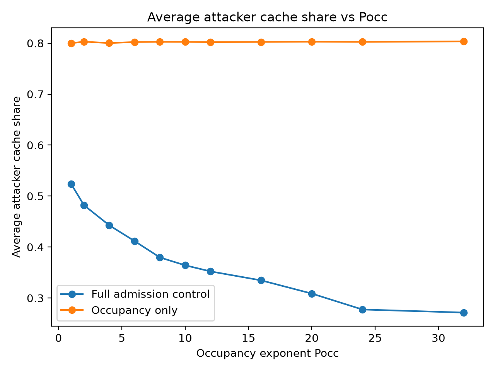
       
      <strong>Figure 1.</strong> Attacker cache share under the cache-occupation attack.
    </td>
    <td align="center" width="50%">
      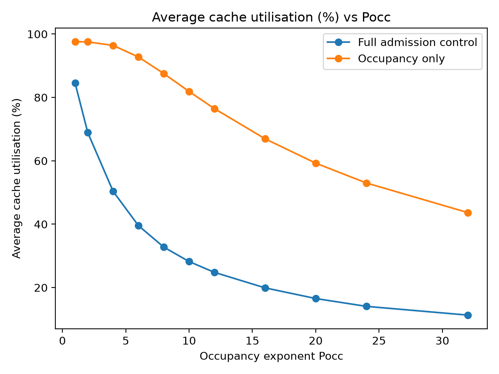
       
      <strong>Figure 2.</strong> Average cache utilisation under the cache-occupation attack.
    </td>
  </tr>
</table>

Under the cache-occupation attack, full admission control substantially reduces attacker cache share as `Pocc` increases. At `Pocc = 1`, the attacker occupies approximately 52% of the cache. At `Pocc = 10`, the attacker share falls to approximately 36%. At `Pocc = 32`, it falls further to approximately 27%.

The occupancy-only baseline is where the waiting time is computed based only on the occupancy component, with no topic or IP diversity penalties. This baseline does not provide comparable protection. Attacker share remains around 80% across the tested range, which is consistent with the honest to attacker request-rate ratio of 1:4.

The security improvement from increasing `Pocc` is accompanied by reduced utilisation. With full admission control, average utilisation is approximately 85% at `Pocc = 1`, approximately 28% at `Pocc = 10`, and approximately 11% at `Pocc = 32`. Very high `Pocc` values therefore protect the cache by making the registrar much more selective, but they also leave substantial cache capacity unused.

### 5.3 Target-topic attack

 <table>
  <tr>
    <td align="center" width="50%">
      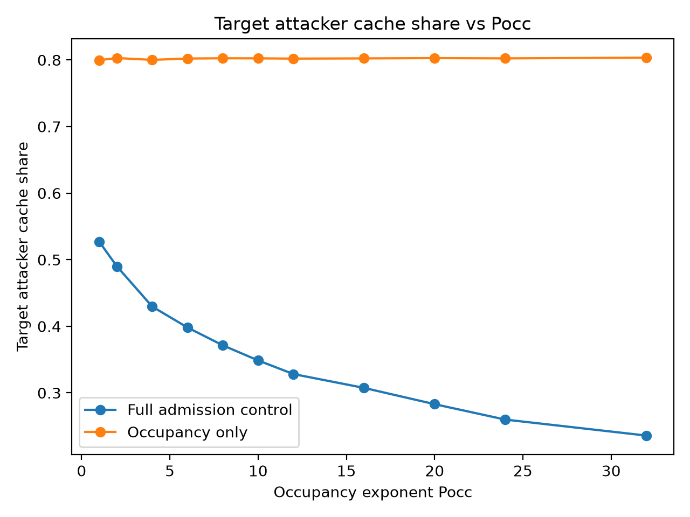
       
      <strong>Figure 3.</strong> Target-topic attacker cache share as <code>Pocc</code> varies.
    </td>
    <td align="center" width="50%">
      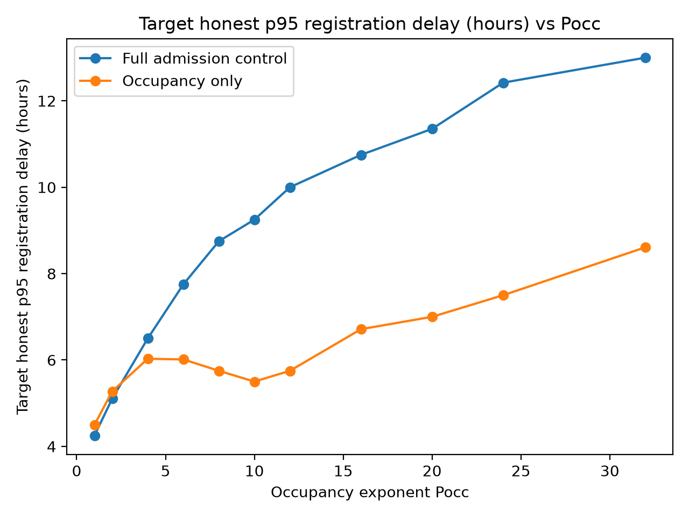
       
      <strong>Figure 4.</strong> Target-topic honest p95 registration delay as <code>Pocc</code> varies.
    </td>
  </tr>
</table>

The target-topic attack shows the same qualitative pattern. With full admission control, target attacker share falls from approximately 53% at `Pocc = 1` to approximately 35% at `Pocc = 10`, and approximately 24% at `Pocc = 32`. With occupancy-only admission, the attacker remains around 80% of the target-topic share. This confirms that the diversity terms are not incidental: they are central to preventing repeated registrations for the same topic from dominating the cache.

  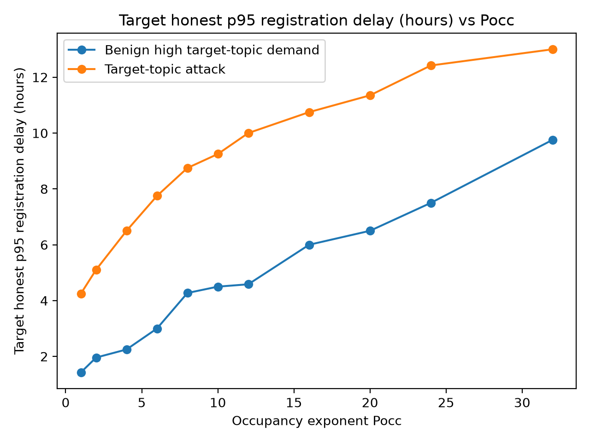

**Figure 5.** Target-topic honest p95 registration delay when 50% of honest registrations use the target topic, with and without a target-topic attacker. 

The cost of higher `Pocc` is increased delay for honest target-topic registrations. With full admission control, target-topic honest p95 delay increases from about 15300s at `Pocc = 1` to about 33300s at `Pocc = 10`, and about 46800s at `Pocc = 32`. This confirms that larger `Pocc` values do not give a free security improvement.

In the above target-topic delay results, the attacked topic is also configured as a popular honest topic: 50% of honest registrations advertise the same service. Consequently, honest advertisers for the target topic contend not only with the attacker, but also with each other under the topic-similarity term. To separate these effects, Figure 5 compares the target-topic attack with an otherwise identical benign workload in which 50% of honest registrations use the target topic but no attacker is present. The benign workload already produces substantial p95 delay, indicating that a large part of the observed waiting time is a cost of enforcing topic diversity for a highly popular service. 

### 5.4 FIFO baseline

The above comparison does not yet tell us whether the high waiting times are caused simply by finite cache capacity or by the admission-control function itself. To separate these effects, we introduce a FIFO cache baseline. The FIFO baseline uses the same cache capacity `C = 1000`, advertisement lifetime `E = 900s`, honest request rate, and renewal behaviour, but removes the waiting-time function. Requests are admitted in arrival order whenever cache space is available. Therefore, FIFO represents the delay we would expect from capacity pressure alone, without diversity-based admission control.

Both the FIFO baseline and the admission-control curve in this comparison use the same honest-only workload. There is no attacker in this experiment. The comparison therefore isolates the cost introduced by the admission-control waiting-time function itself, rather than the additional delay caused by adversarial traffic.

  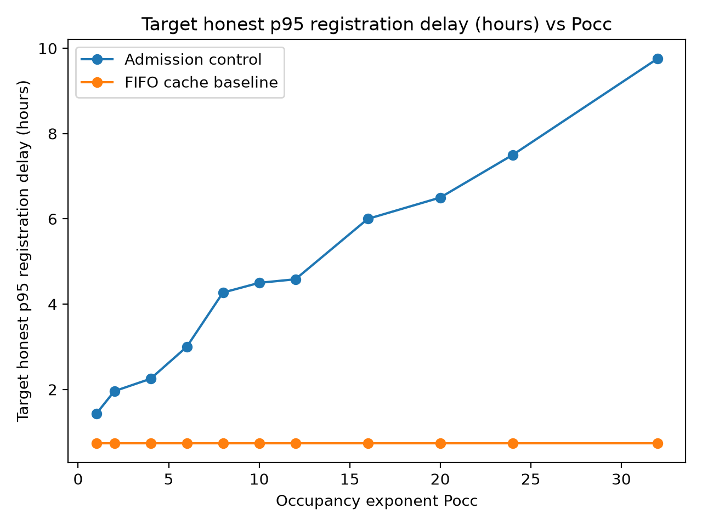

**Figure 6.** Target-topic honest p95 registration delay under an honest-only workload where 50% of honest registrations use the target topic. The FIFO baseline uses the same cache capacity and advertisement lifetime, but admits requests in arrival order rather than applying the admission waiting-time function.

Figure 6 shows that under the same honest-only high target-topic workload, FIFO produces a target-topic honest p95 delay of approximately 0.75 hours. Admission control produces substantially higher delays as `Pocc` increases; at `Pocc = 10`, target-topic honest p95 delay is approximately 4.5 hours. The additional delay is therefore not an unavoidable consequence of finite cache capacity or renewal pressure alone. It is introduced by the diversity-based waiting-time function, especially the topic-similarity term when many honest advertisers legitimately use the same service.

### 5.5 Implication for parameter choice

We choose `Pocc = 10` because it results in a substantial reduction in attacker cache share (see Figure 3) relative to low values such as `Pocc = 1` or `Pocc = 2`, while avoiding the severe under-utilisation observed at higher values. `Pocc = 10` is not optimal in a universal sense, but it lies near the middle of the observed protection/utilisation trade-off for the evaluated workloads.

The experiment also clarifies the role of the diversity terms. Occupancy alone prevents unconstrained growth, but it does not prevent attacker dominance. The full formula is needed because the problem is not only how full the cache is, but also what composition the cache has under adversarial load.

The FIFO baseline further shows that the high delays observed for popular honest topics are not caused by capacity pressure alone. They are a consequence of the diversity-based waiting-time function. This is an intentional design trade-off, but it also means that `Pocc` should not be set too high.

## 6. Q2: Choosing the cache capacity `C`

### 6.1 Why this question matters

The cache capacity `C` determines the number of ads that can be stored in the registrar. It is tempting to treat a larger cache as always better because it gives more space to honest advertisers. However, capacity also changes the security regime. A larger cache reduces scarcity pressure, which can lower honest delay but also allow attackers to maintain more entries.

The purpose of this experiment is to determine how capacity affects honest delay and attacker cache share when the rest of the admission protocol is fixed at its default operating point.

### 6.2 Cache-occupation attack

<table>
  <tr>
    <td align="center" width="50%">
      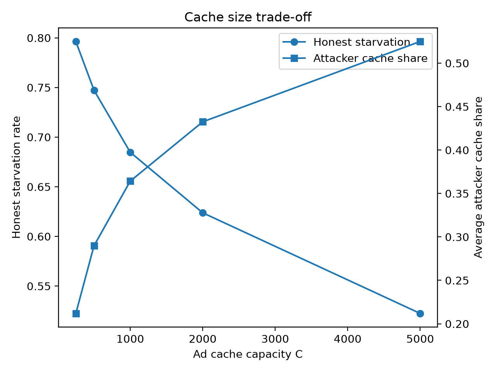
       
      <strong>Figure 7.</strong> Capacity trade-off under cache occupation.
    </td>
    <td align="center" width="50%">
      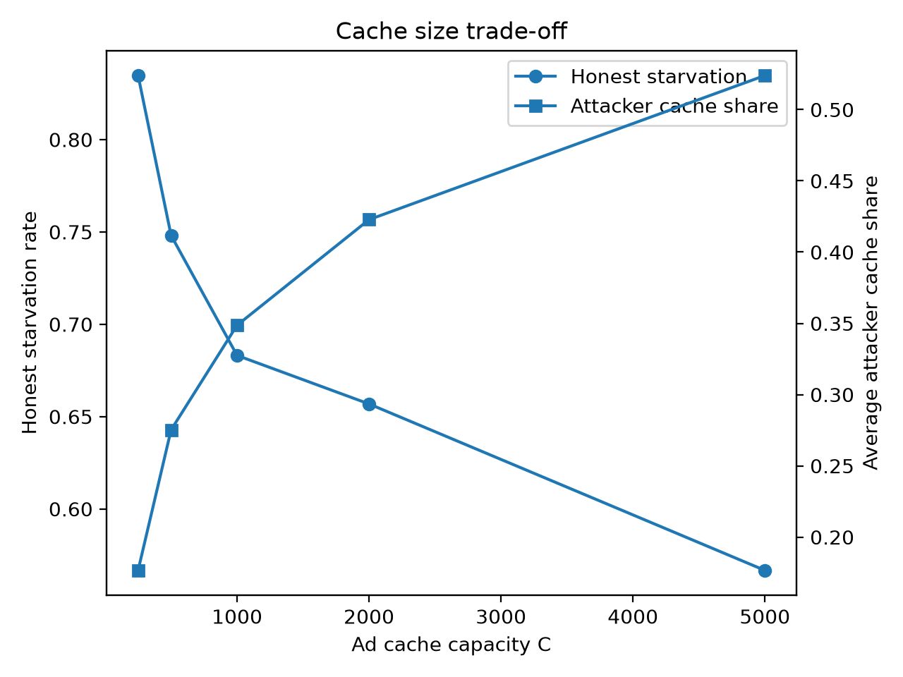
       
      <strong>Figure 8.</strong> Capacity trade-off under target-topic attack.
    </td>
  </tr>
</table>

Under cache occupation, increasing `C` reduces honest delay. Honest p95 delay falls from approximately 57600s at `C = 100` to approximately 20825s at `C = 1000`, and to approximately 8140s at `C = 5000`.

However, larger capacity also increases attacker cache share. The attacker share is approximately 21% at `C = 100`, approximately 36% at `C = 1000`, and approximately 52% at `C = 5000`. This means that increasing capacity is not equivalent to increasing security. It improves availability for honest registrations, but also gives attackers more room to maintain admitted advertisements.

### 6.3 Target-topic attack

The target-topic experiment shows a similar trade-off. Target-topic honest p95 delay falls from approximately 69300s at `C = 100` to approximately 33300s at `C = 1000`, and to approximately 13500s at `C = 5000`. At the same time, target attacker cache share rises from approximately 8% at `C = 100` to approximately 35% at `C = 1000`, and approximately 52% at `C = 5000`.

### 6.4 Implication for parameter choice

Capacity should be viewed primarily as a resource-sizing parameter rather than a direct security parameter. Increasing `C` can reduce honest waiting time, but it also weakens scarcity and permits a larger attacker presence. The default value `C = 1000` avoids the extreme delays observed for very small caches while preserving enough scarcity for the admission mechanism to constrain attacker share.

## 7. Q3: Rationale for the IP-diversity score

### 7.1 Why this question matters

The IP-diversity term is intended to make Sybil registration more expensive when many identities originate from the same or similar IP prefixes. Without such a term, an attacker can use many node identities behind a small network footprint and convert request volume into cache share. The question is therefore whether the IP-diversity term provides a measurable benefit beyond the occupancy and topic terms.

This is evaluated by comparing full admission control against an ablation in which the IP score is disabled.

### 7.2 Results

<table>
  <tr>
    <td align="center" width="50%">
      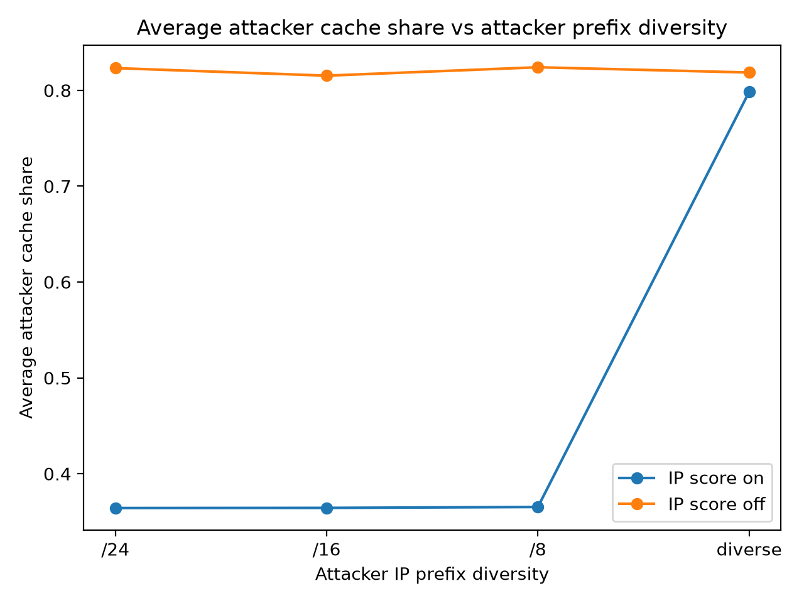
       
      <strong>Figure 9.</strong> Attacker cache share with IP scoring enabled and disabled under different attacker prefix assumptions.
    </td>
    <td align="center" width="50%">
      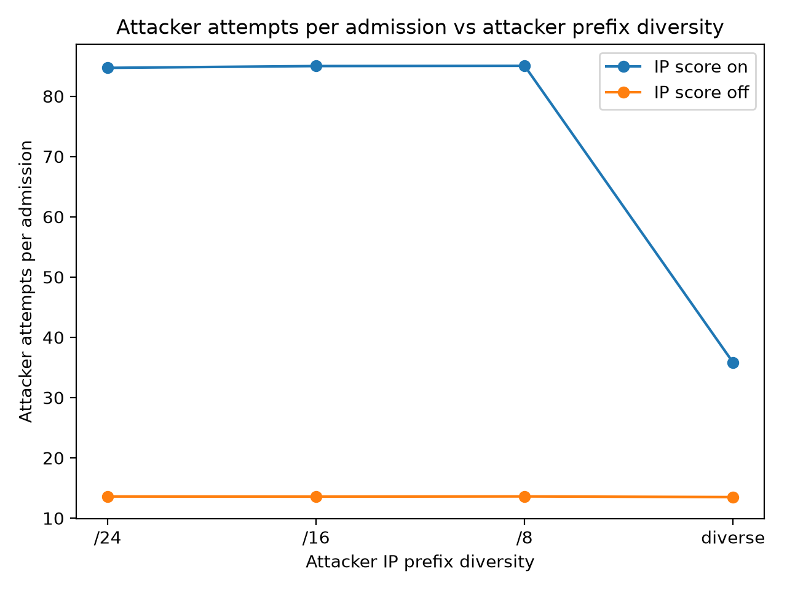
       
      <strong>Figure 10.</strong> Attacker attempts per admission with and without IP scoring.
    </td>
  </tr>
</table>
The IP score has a strong effect for prefix-concentrated attackers. For a `/24` attacker, where attacker IP addresses are drawn from the same `/24` prefix, attacker cache share is approximately 36% with IP scoring enabled and approximately 82% when IP scoring is disabled. The result is similar for `/16` and `/8` attackers in this configuration.

This similarity is due to how the implemented IP score is computed. The simulator uses a binary IP prefix tree over the IP addresses currently represented in the cache. For a candidate IP address, the score walks down the candidate's prefix path and checks whether each evaluated prefix bucket is already more populated than expected under a balanced distribution of cached IPs. The score only evaluates prefix levels while the expected balanced bucket occupancy is at least one. With a cache size of `C = 1000`, this means the score mainly captures coarse prefix concentration, rather than distinguishing deeply between `/8`, `/16`, and `/24` structure. In this workload, all three attacker models are concentrated enough to overload these coarse prefix buckets, so they receive similar IP-diversity penalties.

For a genuinely diverse attacker, the IP score no longer provides the same protection: attacker share is approximately 80% even with IP scoring enabled. 

The cost imposed on concentrated attackers is also visible in attempts per admission. Under the `/24` attack, enabling IP scoring increases attacker attempts per admission from about 14 to about 85. This indicates that the IP-diversity term does not merely reduce cache share; it also changes the cost curve faced by the attacker. Concentrated attackers can still obtain admissions, but they must make substantially more attempts per successful admission.

## 8. Q4: Cost of topic similarity for popular honest topics

### 8.1 Why this question matters

The topic-similarity term is motivated by target-topic abuse: a registrar should not allow one topic to dominate its cache simply because many registration attempts are made for that topic. However, the same mechanism can also penalise legitimate popularity. If many honest advertisers genuinely belong to the same service topic, the topic-similarity term may delay them and under-represent that service at a single registrar.

This experiment therefore asks a different type of question from the attack experiments. It measures the benign cost of the topic-similarity term under no attack.

### 8.2 Results

<table>
  <tr>
    <td align="center" width="50%">
      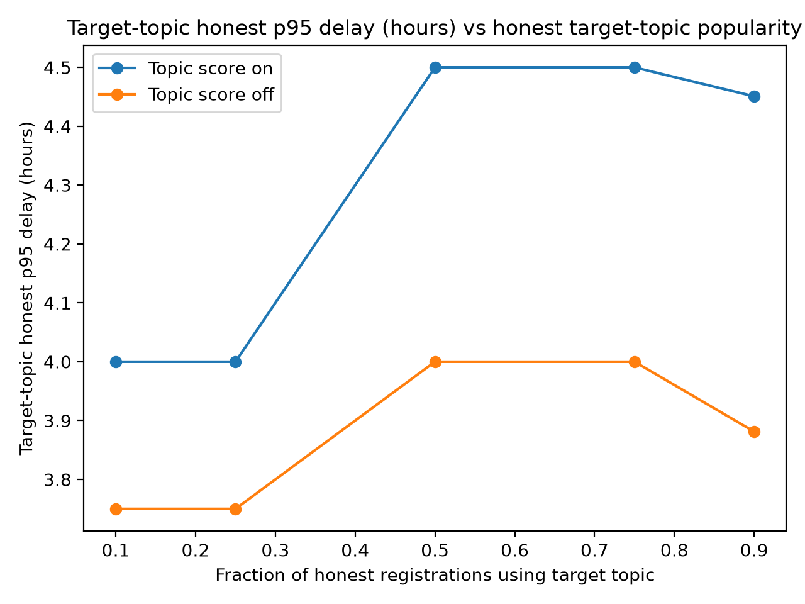
       
      <strong>Figure 11.</strong> Target-topic honest p95 delay as the fraction of honest target-topic demand increases.
    </td>
    <td align="center" width="50%">
      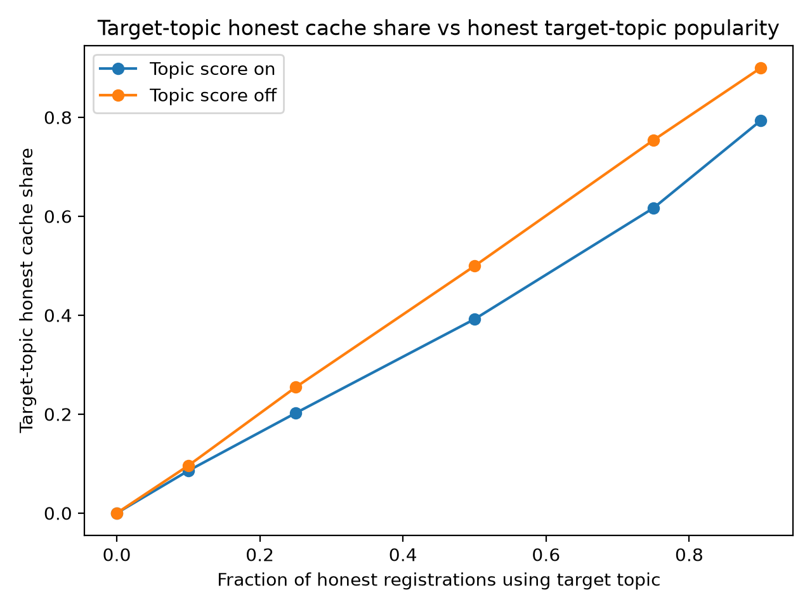
       
      <strong>Figure 12.</strong> Target-topic cache share as a function of honest target-topic demand.
    </td>
  </tr>
</table>

When topic scoring is enabled, target-topic honest registrations experience higher delay as the target topic becomes more popular. At 90% target-topic demand, target-topic p95 delay is approximately 16023s with topic scoring enabled and approximately 13972s with topic scoring disabled. The cost is not catastrophic in this workload, but it is measurable.

The cache-share result shows the mechanism's intended effect. With topic scoring enabled, target-topic cache share grows sub-linearly with demand. At 90% target-topic demand, the target topic receives approximately 79% of the cache. With topic scoring disabled, the cache share tracks demand more directly; at 90% demand, the target topic receives approximately 90% of the cache.

### 8.3 Implication for parameter choice

The topic-similarity term should be retained because it is essential for target-topic abuse resistance. However, it should be documented as a deliberate diversity trade-off. A registrar using topic similarity does not aim to mirror global topic popularity exactly. Instead, it deliberately limits the extent to which any one topic can dominate a local cache.

This is acceptable if discovery is expected to use multiple registrars and if popular services can be represented across the network rather than relying on unrestricted dominance at each registrar. The design implication is that topic similarity improves robustness and diversity at the cost of some delay for legitimately popular topics.

## 9. Q5: Robustness under increasing attack intensity

### 9.1 Why this question matters

Q1 varies the protocol parameter `Pocc`. Q5 fixes the protocol parameters and varies attacker intensity. The goal here is to examine whether the chosen default operating point degrades gracefully.

The experiments fix `Pocc = 10`, `C = 1000`, `E = 900s`, and `G = 1e-7`, then vary the attacker registration rate from `0.02/s` to `0.4/s`, with honest rate fixed at `0.05/s`.

### 9.2 Cache-occupation attack

<table>
  <tr>
    <td align="center" width="50%">
      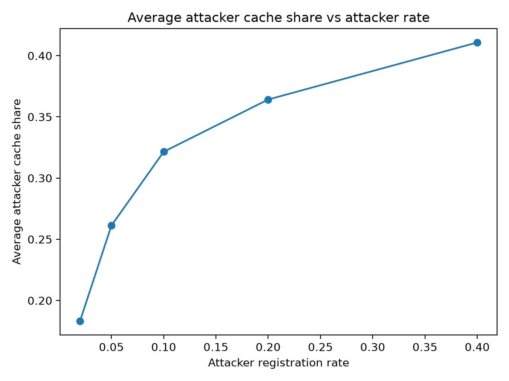
       
      <strong>Figure 13.</strong> Attacker cache share under increasing cache-occupation attack intensity.
    </td>
    <td align="center" width="50%">
      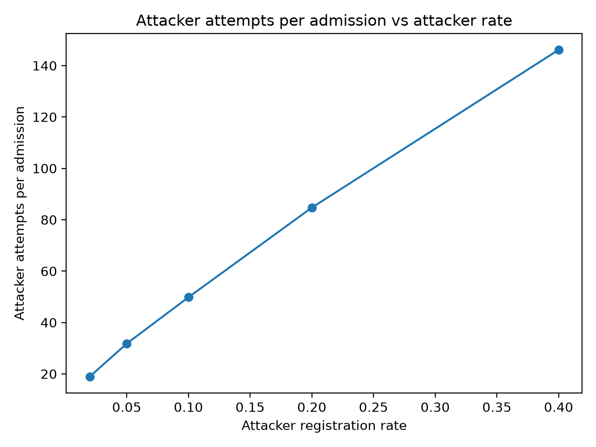
       
      <strong>Figure 14.</strong> Attacker attempts per admission under increasing cache-occupation attack intensity.
    </td>
  </tr>
</table>

Under cache occupation, attacker cache share increases with attacker rate, but less than proportionally. Attacker share is approximately 18% at attacker rate `0.02/s`, approximately 36% at `0.2/s`, and approximately 41% at `0.4/s`.

The cost to the attacker rises more sharply. Attacker attempts per admission increase from approximately 19 at attacker rate `0.02/s` to approximately 85 at `0.2/s`, and approximately 146 at `0.4/s`. The mechanism therefore does not completely exclude the attacker, but it makes additional admitted cache share increasingly expensive.

### 9.3 Target-topic attack

<table>
  <tr>
    <td align="center" width="50%">
      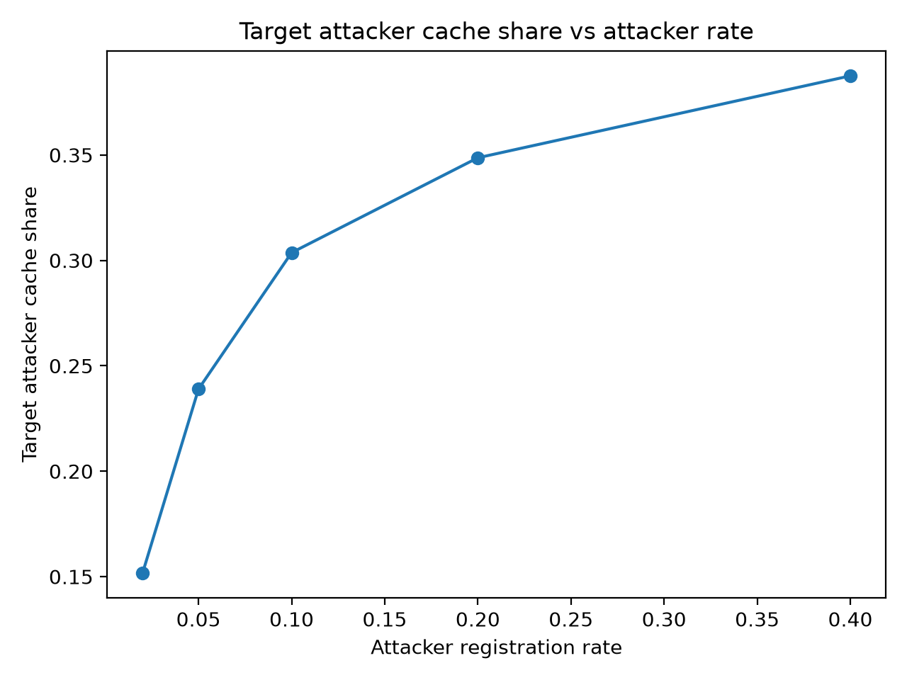
       
      <strong>Figure 15.</strong> Target-topic attacker cache share under increasing attack intensity.
    </td>
    <td align="center" width="50%">
      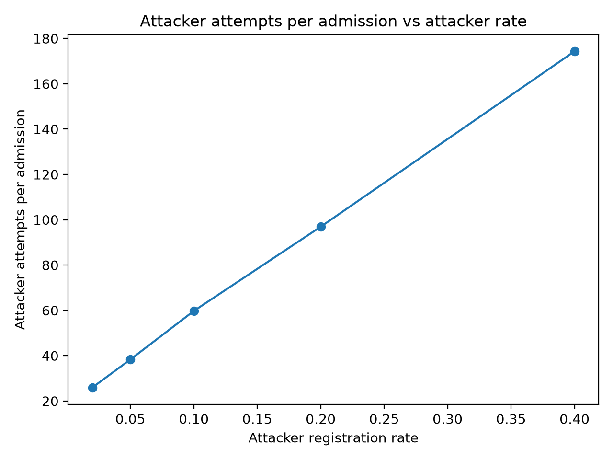
       
      <strong>Figure 16.</strong> Attacker attempts per admission under increasing target-topic attack intensity.
    </td>
  </tr>
</table>

Under the target-topic attack, target attacker share increases from approximately 15% at attacker rate `0.02/s` to approximately 35% at `0.2/s`, and approximately 39% at `0.4/s`.

The attacker's cost increases sharply. Attempts per admission rise from approximately 26 at attacker rate `0.02/s` to approximately 97 at `0.2/s`, and approximately 174 at `0.4/s`.

### 9.4 Implication for parameter choice

These results support interpreting admission control as a cost-imposition mechanism rather than an absolute exclusion mechanism. Increasing attacker rate still increases attacker cache share, but the marginal cost of admitted advertisements also increases substantially. This supports the default parameter choice because it provides graceful degradation under stronger attack intensity rather than immediate cache capture.

## 10. Recommended parameter values

The experiments support the following default values and mechanism choices.

| Component | Recommendation | Rationale |
|---|---:|---|
| Advertisement lifetime `E` | `900s` | Provides a bounded cache residency interval and defines the natural expiry cycle used by the registrar. |
| Cache capacity `C` | `1000` | Balances honest delay and scarcity pressure in the evaluated attack scenarios. Smal values produce high delay;  larger values reduce delay but allow larger attacker share in the cache. |
| Occupancy exponent `Pocc` | `10` | Provides substantial reduction in attacker cache share relative to low values, while avoiding the severe under-utilisation seen at very high values. |
| Safety constant `G` | `1e-7` | Acts as a small non-zero floor without materially dominating the diversity or occupancy terms in the tested workloads. |

The central rationale is that the default setting should prioritise cache diversity and abuse resistance while preserving usable, though not maximal, cache utilisation. `Pocc = 10` and `C = 1000` should be understood as pragmatic defaults rather than universal optima. They are appropriate for the evaluated workload and attack rates, but deployments with different resource constraints or threat models may tune them differently.

## 11. Summary

The experiments show that admission-control parameter choices cannot be justified by cache utilisation alone. Under abuse, the relevant question is the composition of the cache and the cost imposed on attackers.

The occupancy exponent `Pocc` controls how aggressively the registrar reacts to cache pressure. Increasing `Pocc` reduces attacker cache share but increases honest delay and reduces utilisation. The value `Pocc = 10` provides a defensible middle point in this trade-off.

The cache capacity `C` controls the amount of registrar-local storage. A value of `C = 1000` is a reasonable default in the evaluated workloads, but capacity is deployment-dependent. Larger caches reduce honest delay but can allow greater attacker representation.

The diversity terms are necessary. Occupancy-only admission cannot prevent attacker dominance. IP-diversity scoring is especially effective against concentrated-prefix attackers, while topic similarity protects against target-topic flooding. Both terms therefore serve a security purpose, although topic similarity also imposes a measurable cost on legitimately popular topics.

Overall, the recommended parameters favour registrar-local diversity, bounded cache occupation, and increased attacker cost while maintaining usable admission behaviour for honest advertisers.
