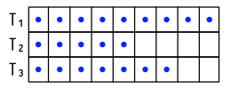
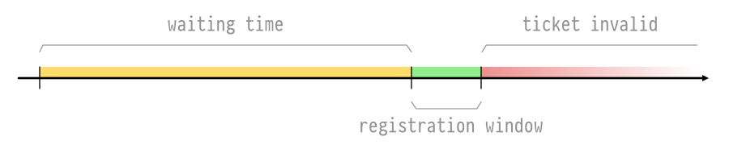
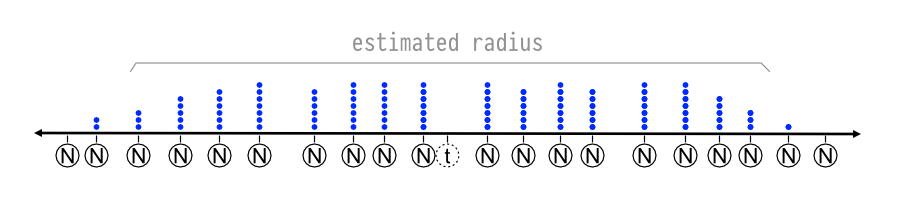

# Node Discovery Protocol v5 - Theory

**Draft of October 2019.**

Note that this specification is a work in progress and may change incompatibly without
prior notice.

## Nodes, Records and Distances

A participant in the Node Discovery Protocol is represented by a 'node record' as defined
in [EIP-778]. The node record keeps arbitrary information about the node. For the purposes
of this protocol, the node must at least provide an IP address (`"ip"` or `"ip6"` key) and
UDP port (`"udp"` key) in order to have it's record relayed in the DHT.

Node records are signed according to an 'identity scheme'. Any scheme can be used with
Node Discovery Protocol, and nodes using different schemes can communicate.

The identity scheme of a node record defines how a 32-byte 'node ID' is derived from the
information contained in the record. The 'distance' between two node IDs is the bitwise
XOR of the IDs, taken as the number.

    distance(n₁, n₂) = n₁ XOR n₂

In many situations, the logarithmic distance (i.e. length of common prefix in bits) is
used in place of the actual distance.

    logdistance(n₁, n₂) = log2(distance(n₁, n₂))

## Maintaining The Local Node Record

Participants should update their record, increase the sequence number and sign a new
version of the record whenever their information changes. This is especially important for
changes to the node's IP address and port. Implementations should determine the external
endpoint (the Internet-facing IP address and port on which the node can be reached) and
include it in their record.

If communication flows through a NAT device, the UPnP/NAT-PMP protocols or the mirrored
UDP envelope IP and port found in the [PONG] message can be used to determine the external
IP address and port.

If the endpoint cannot be determined (e.g. when the NAT doesn't support 'full-cone'
translation), implementation should omit IP address and UDP port from the record.

## Node Table

Nodes keep information about other nodes in their neighborhood. Neighbor nodes are stored
in a routing table consisting of 'k-buckets'. For each `0 ≤ i < 256`, every node keeps a
k-bucket for nodes of `logdistance(self, n) == i`. The Node Discovery Protocol uses `k =
16`, i.e. every k-bucket contains up to 16 node entries. The entries are sorted by time
last seen — least-recently seen node at the head, most-recently seen at the tail.

Whenever a new node N₁ is encountered, it can be inserted into the corresponding bucket.
If the bucket contains less than `k` entries N₁ can simply be added as the first entry. If
the bucket already contains `k` entries, the liveness of the least recently seen node in
the bucket, N₂, needs to be revalidated. If no reply is received from N₂ it is considered
dead, removed and N₁ added to the front of the bucket.

Neighbors of very low distance are unlikely to occur in practice. Implementations may omit
buckets for low distances.

### Table Maintenance In Practice

Nodes are expected to keep track of their close neighbors and regularly refresh their
information. To do so, a lookup targeting the least recently refreshed bucket should be
performed at regular intervals.

Checking node liveness whenever a node is to be added to a bucket is impractical and
creates a DoS vector. Implementations can perform liveness checks asynchronously with
bucket addition and occasionally verify that a random node in a random bucket is live by
sending [PING]. When the PONG response indicates that a new version of the node record is
available, the liveness check should pull the new record and update it in the local table.

For FINDNODE, implementations must avoid returning any nodes whose liveness has not been
verified.

### Recursive Lookup

A 'lookup' locates the `k` closest nodes to a node ID.

The lookup initiator starts by picking `α` closest nodes to the target it knows of. The
initiator then sends concurrent [FINDNODE] packets to those nodes. `α` is an
implementation-defined concurrency parameter, typically `3`. In the recursive step, the
initiator resends FINDNODE to nodes it has learned about from previous queries. Of the `k`
nodes the initiator has heard of closest to the target, it picks `α` that it has not yet
queried and sends FINDNODE to them. Nodes that fail to respond quickly are removed from
consideration until and unless they do respond.

If a round of FINDNODE queries fails to return a node any closer than the closest already
seen, the initiator resends the find node to all of the `k` closest nodes it has not
already queried. The lookup terminates when the initiator has queried and gotten responses
from the `k` closest nodes it has seen.

## Topic Advertisement

The topic advertisement subsystem indexes participants by their provided services. A
node's provided services are identified by arbitrary strings called 'topics'. A node
providing a certain service is said to 'place an ad' for itself when it makes itself
discoverable under that topic. Depending on the needs of the application, a node can
advertise multiple topics or no topics at all. Every node participating in the discovery
protocol acts as an advertisement medium, meaning that it accepts topic ads from other
nodes and later returns them to nodes searching for the same topic.

### Topic Table

Nodes store ads for any number of topics and a limited number of ads for each topic. The
data structure holding advertisements is called the 'topic table'. The list of ads for a
particular topic is called the 'topic queue' because it functions like a FIFO queue of
limited length. The image below depicts a topic table containing three queues. The queue
for topic `T₁` is at capacity.

The queue size limit is implementation-defined. Implementations should place a global
limit on the number of ads in the topic table regardless of the topic queue which contains
them. Reasonable limits are 100 ads per queue and 50000 ads across all queues. Since ENRs
are at most 300 bytes in size, these limits ensure that a full topic table consumes
approximately 15MB of memory.

Any node may appear at most once in any topic queue, that is, registration of a node which
is already registered for a given topic fails. Implementations may impose other
restrictions on the table, such as restrictions on the number of IP-addresses in a certain
range or number of occurrences of the same node across queues.

### Tickets

Ads should remain in the queue for a constant amount of time, the `target-ad-lifetime`. To
maintain this guarantee, new registrations are throttled and registrants must wait for a
certain amount of time before they are admitted. When a node attempts to place an ad, it
receives a 'ticket' which tells them how long they must wait before they will be accepted.
It is up to the registrant node to keep the ticket and present it to the advertisement
medium when the waiting time has elapsed.

The waiting time constant is:

    target-ad-lifetime = 15min

The assigned waiting time for any registration attempt is determined according to the
following rules:

- When the table is full, the waiting time is assigned based on the lifetime of the oldest
  ad across the whole table, i.e. the registrant must wait for a table slot to become
  available.
- When the topic queue is full, the waiting time depends on the lifetime of the oldest ad
  in the queue. The assigned time is `target-ad-lifetime - oldest-ad-lifetime` in this
  case.
- Otherwise the ad may be placed immediately.

Tickets are opaque objects storing arbitrary information determined by the issuing node.
While details of encoding and ticket validation are up to the implementation, tickets must
contain enough information to verify that:

- The node attempting to use the ticket is the node which requested it.
- The ticket is valid for a single topic only.
- The ticket can only be used within the registration window.
- The ticket can't be used more than once.

Implementations may choose to include arbitrary other information in the ticket, such as
the cumulative wait time spent by the advertiser. A practical way to handle tickets is to
encrypt and authenticate them with a dedicated secret key:

    ticket       = aesgcm_encrypt(ticket-key, ticket-nonce, ticket-pt, '')
    ticket-pt    = [src-node-id, src-ip, topic, req-time, wait-time, cum-wait-time]
    src-node-id  = node ID that requested the ticket
    src-ip       = IP address that requested the ticket
    topic        = the topic that ticket is valid for
    req-time     = absolute time of REGTOPIC request
    wait-time    = waiting time assigned when ticket was created
    cum-wait     = cumulative waiting time of this node

### Registration Window

The image below depicts a single ticket's validity over time. When the ticket is issued,
the node keeping it must wait until the registration window opens. The length of the
registration window is 10 seconds. The ticket becomes invalid after the registration
window has passed.

Since all ticket waiting times are assigned to expire when a slot in the queue opens, the
advertisement medium may receive multiple valid tickets during the registration window and
must choose one of them to be admitted in the topic queue. The winning node is notified
using a [REGCONFIRMATION] response.

Picking the winner can be achieved by keeping track of a single 'next ticket' per queue
during the registration window. Whenever a new ticket is submitted, first determine its
validity and compare it against the current 'next ticket' to determine which of the two is
better according to an implementation-defined metric such as the cumulative wait time
stored in the ticket.

### Advertisement Protocol

This section explains how the topic-related protocol messages are used to place an ad.

Let us assume that node `A` provides topic `T`. It selects node `C` as advertisement
medium and wants to register an ad, so that when node `B` (who is searching for topic `T`)
asks `C`, `C` can return the registration entry of `A` to `B`.

Node `A` first attempts to register without a ticket by sending [REGTOPIC] to `C`.

    A -> C  REGTOPIC [T, ""]

`C` replies with a ticket and waiting time.

    A <- C  TICKET [ticket, wait-time]

Node `A` now waits for the duration of the waiting time. When the wait is over, `A` sends
another registration request including the ticket. `C` does not need to remember its
issued tickets since the ticket is authenticated and contains enough information for `C`
to determine its validity.

    A -> C  REGTOPIC [T, ticket]

Node `C` replies with another ticket. Node `A` must keep this ticket in place of the
earlier one, and must also be prepared to handle a confirmation call in case registration
was successful.

    A <- C  TICKET [ticket, wait-time]

Node `C` waits for the registration window to end on the queue and selects `A` as the node
which is registered. Node `C` places `A` into the topic queue for `T` and sends a
[REGCONFIRMATION] response.

    A <- C  REGCONFIRMATION [T]

### Ad Placement And Topic Radius

Since every node may act as an advertisement medium for any topic, advertisers and nodes
looking for ads must agree on a scheme by which ads for a topic are distributed. When the
number of nodes advertising a topic is at least a certain percentage of the whole
discovery network (rough estimate: at least 1%), ads may simply be placed on random nodes
because searching for the topic on randomly selected will locate the ads quickly enough.

However, topic search should be fast even when the number of advertisers for a topic is
much smaller than the number of all live nodes. Advertisers and searchers must agree on a
subset of nodes to serve as advertisement media for the topic. This subset is simply a
region of node ID address space, consisting of nodes whose Kademlia address is within a
certain distance to the topic hash `sha256(T)`. This distance is called the 'topic
radius'.

Example: for a topic `f3b2529e...` with a radius of 2^240, the subset covers all nodes
whose IDs have prefix `f3b2...`. A radius of 2^256 means the entire network, in which case
advertisements are distributed uniformly among all nodes. The diagram below depicts a
region of address space with the topic hash `t` in the middle and several nodes close to
`t` surrounding it. Dots above the nodes represent entries in the node's queue for the
topic.

To place their ads, participants simply perform a random walk within the currently
estimated radius and run the advertisement protocol by collecting tickets from all nodes
encountered during the walk and using them when their waiting time is over.

### Topic Radius Estimation

Advertisers must estimate the topic radius continuously in order to place their ads on
nodes where they will be found. The radius mustn't fall below a certain size because
restricting registration to too few nodes leaves the topic vulnerable to censorship and
leads to long waiting times. If the radius were too large, searching nodes would take too
long to find the ads.

Estimating the radius uses the waiting time as an indicator of how many other nodes are
attempting to place ads in a certain region. This is achieved by keeping track of the
average time to successful registration within segments of the address space surrounding
the topic hash. Advertisers initially assume the radius is 2^256, i.e. the entire network.
As tickets are collected, the advertiser samples the time it takes to place an ad in each
segment and adjusts the radius such that registration at the chosen distance takes
approximately `target-ad-lifetime / 2` to complete.

## Topic Search

Finding nodes that provide a certain topic is a continuous process which reads the content
of topic queues inside the approximated topic radius. This is a much simpler process than
topic advertisement because collecting tickets and waiting on them is not required.

To find nodes for a topic, the searcher generates random node IDs inside the estimated
topic radius and performs Kademlia lookups for these IDs. All (intermediate) nodes
encountered during lookup are asked for topic queue entries using the [TOPICQUERY] packet.

Radius estimation for topic search is similar to the estimation procedure for
advertisement, but samples the average number of results from TOPICQUERY instead of
average time to registration. The radius estimation value can be shared with the
registration algorithm if the the same topic is being registered and searched for.

[EIP-778]: https://eips.ethereum.org/EIPS/eip-778
[PING]: ./discv5-wire.md#ping-request-0x01
[PONG]: ./discv5-wire.md#pong-response-0x02
[FINDNODE]: ./discv5-wire.md#findnode-request-0x03
[REGTOPIC]: ./discv5-wire.md#regtopic-request-0x05
[REGCONFIRMATION]: ./discv5-wire.md#regconfirmation-response-0x07
[TOPICQUERY]: ./discv5-wire.md#topicquery-request-0x08
