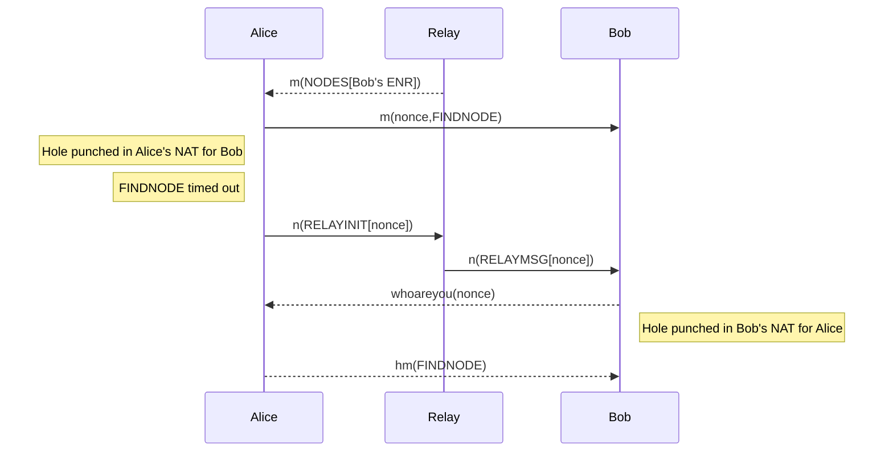

# Node Discovery Protocol v5 - Theory

**Protocol version v5.2**

This document explains the algorithms and data structures used by the protocol.

## Nodes, Records and Distances

A participant in the Node Discovery Protocol is represented by a 'node record' as defined
in [EIP-778]. The node record keeps arbitrary information about the node. For the purposes
of this protocol, the node must at least provide an IP address (`"ip"` or `"ip6"` key) and
UDP port (`"udp"` key) in order to have it's record relayed in the DHT.

Node records are signed according to an 'identity scheme'. Any scheme can be used with
Node Discovery Protocol, and nodes using different schemes can communicate.

The identity scheme of a node record defines how a 32-byte 'node ID' is derived from the
information contained in the record. The 'distance' between two node IDs is the bitwise
XOR of the IDs, taken as the big-endian number.

    distance(n₁, n₂) = n₁ XOR n₂

In many situations, the logarithmic distance (i.e. length of differing suffix in bits) is
used in place of the actual distance.

    logdistance(n₁, n₂) = log2(distance(n₁, n₂))

### Maintaining The Local Node Record

Participants should update their record, increase the sequence number and sign a new
version of the record whenever their information changes. This is especially important for
changes to the node's IP address and port. Implementations should determine the external
endpoint (the Internet-facing IP address and port on which the node can be reached) and
include it in their record.

If communication flows through a NAT device, the UPnP/NAT-PMP protocols or the mirrored
UDP envelope IP and port found in the [PONG] message can be used to determine the external
IP address and port.

If the endpoint cannot be determined (e.g. when the NAT doesn't support 'full-cone'
translation), implementations should omit IP address and UDP port from the record.

## Sessions

Discovery communication is encrypted and authenticated using session keys, established in
the handshake. Since every node participating in the network acts as both client and
server, a handshake can be initiated by either side of communication at any time.

### Handshake Steps

#### Step 1: Node A sends message packet

In the following definitions, we assume that node A wishes to communicate with node B,
e.g. to send a FINDNODE message. Node A must have a copy of node B's record in order to
communicate with it.

If node A has session keys from prior communication with B, it encrypts its request with
those keys. If no keys are known, it initiates the handshake by sending an ordinary
message packet with random message content.

    A -> B   FINDNODE message packet encrypted with unknown key

#### Step 2: Node B responds with challenge

Node B receives the message packet and extracts the source node ID from the packet header.
If node B has session keys from prior communication with A, it attempts to decrypt the
message data. If decryption and authentication of the message succeeds, there is no need
for a handshake and node B can simply respond to the request.

If node B does not have session keys or decryption is not successful, it must initiate a
handshake by responding with a [WHOAREYOU packet].

It first generates a unique `id-nonce` value and includes it in the packet. Node B also
checks if it has a copy of node A's record. If it does, it also includes the sequence
number of this record in the challenge packet, otherwise it sets the `enr-seq` field to
zero.

Node B must also store the A's record and the WHOAREYOU challenge for a short duration
after sending it to node A because they will be needed again in step 4.

    A <- B   WHOAREYOU packet including id-nonce, enr-seq

#### Step 3: Node A processes the challenge

Node A receives the challenge sent by node B, which confirms that node B is alive and is
ready to perform the handshake. The challenge can be traced back to the request packet
which solicited it by checking the `nonce`, which mirrors the request packet's `nonce`.

Node A proceeds with the handshake by re-sending the FINDNODE request as a [handshake
message packet]. This packet contains three parts in addition to the message:
`id-signature`, `ephemeral-pubkey` and `record`.

The handshake uses the unmasked WHOAREYOU challenge as an input:

    challenge-data     = masking-iv || static-header || authdata

Node A can now derive the new session keys. To do so, it first generates an ephemeral key
pair on the elliptic curve used by node B's identity scheme. As an example, let's assume
the node record of B uses the "v4" scheme. In this case the `ephemeral-pubkey` will be a
public key on the secp256k1 curve.

    ephemeral-key      = random private key generated by node A
    ephemeral-pubkey   = public key corresponding to ephemeral-key

The ephemeral key is used to perform Diffie-Hellman key agreement with node B's static
public key and the session keys are derived from it using the HKDF key derivation
function.

    dest-pubkey        = public key corresponding to node B's static private key
    secret             = ecdh(dest-pubkey, ephemeral-key)
    kdf-info           = "discovery v5 key agreement" || node-id-A || node-id-B
    prk                = HKDF-Extract(secret, challenge-data)
    key-data           = HKDF-Expand(prk, kdf-info)
    initiator-key      = key-data[:16]
    recipient-key      = key-data[16:]

Node A creates the `id-signature`, which proves that it controls the private key which
signed its node record. The signature also prevents replay of the handshake.

    id-signature-text  = "discovery v5 identity proof"
    id-signature-input = id-signature-text || challenge-data || ephemeral-pubkey || node-id-B
    id-signature       = id_sign(sha256(id-signature-input))

Finally, node A compares the `enr-seq` element of the WHOAREYOU challenge against its own
node record sequence number. If the sequence number in the challenge is lower, it includes
its record into the handshake message packet.

The request is now re-sent, with the message encrypted using the new session keys.

    A -> B   FINDNODE handshake message packet, encrypted with new initiator-key

#### Step 4: Node B receives handshake message

When node B receives the handshake message packet, it first loads the node record and
WHOAREYOU challenge which it sent and stored earlier.

If node B did not have the node record of node A, the handshake message packet must
contain a node record. A record may also be present if node A determined that its record
is newer than B's current copy. If the packet contains a node record, B must first
validate it by checking the record's signature.

Node B then verifies the `id-signature` against the identity public key of A's record.

After that, B can perform the key derivation using its own static private key and the
`ephemeral-pubkey` from the handshake packet. Using the resulting session keys, it
attempts to decrypt the message contained in the packet.

If the message can be decrypted and authenticated, Node B considers the new session keys
valid and responds to the message. In our example case, the response is a `NODES` message:

    A <- B   NODES encrypted with new recipient-key

#### Step 5: Node A receives response message

Node A receives the message packet response and authenticates/decrypts it with the new
session keys. If decryption/authentication succeeds, node B's identity is verified and
node A also considers the new session keys valid.

### Identity-Specific Cryptography in the Handshake

Establishment of session keys is dependent on the [identity scheme] used by the recipient
(i.e. the node which sends WHOAREYOU). Likewise, the signature over `id-sig-input` is made
by the identity key of the initiator. It is not required that initiator and recipient use
the same identity scheme in their respective node records. Implementations must be able to
perform the handshake for all supported identity schemes.

At this time, the only supported identity scheme is "v4".

`id_sign(hash)` creates a signature over `hash` using the node's static private key. The
signature is encoded as the 64-byte array `r || s`, i.e. as the concatenation of the
signature values.

`ecdh(pubkey, privkey)` creates a secret through elliptic-curve Diffie-Hellman key
agreement. The public key is multiplied by the private key to create a secret ephemeral
key `eph = pubkey * privkey`. The 33-byte secret output is `y || eph.x` where `y` is
`0x02` when `eph.y` is even or `0x03` when `eph.y` is odd.

### Handshake Implementation Considerations

Since a handshake may happen at any time, UDP packets may be reordered by transmitting
networking equipment, implementations must deal with certain subtleties regarding the
handshake.

In general, implementations should keep a reference to all sent request packets until the
request either times out, is answered by the corresponding response packet or answered by
WHOAREYOU. If WHOAREYOU is received as the answer to a request, the request must be
re-sent as a handshake packet.

If an implementation supports sending concurrent requests, multiple responses may be
pending when WHOAREYOU is received, as in the following example:

    A -> B   FINDNODE
    A -> B   PING
    A -> B   TALKREQ
    A <- B   WHOAREYOU (nonce references PING)

When this happens, all buffered requests can be considered invalid (the remote end cannot
decrypt them) and the packet referenced by the WHOAREYOU `nonce` (in this example: PING)
must be re-sent as a handshake. When the response to the re-sent is received, the new
session is established and other pending requests (example: FINDNODE, TOPICQUERY) may be
re-sent.

Note that WHOAREYOU is only ever valid as a response to a previously sent request. If
WHOAREYOU is received but no requests are pending, the handshake attempt can be ignored.

Another important issue is the processing of message packets while a challenge is
received: consider the case where node A has sent a packet that B cannot decrypt, and B
has responded with WHOAREYOU.

    A -> B   FINDNODE
    A <- B   WHOAREYOU

Node B is now waiting for a handshake message packet to complete the new session, but
instead receives another ordinary message packet.

    A -> B   ORDINARY MESSAGE PACKET

In this case, implementations should respond with a new WHOAREYOU challenge referencing
the message packet.

### Session Cache

Nodes should store session keys for communication with other recently-seen nodes. Since
sessions are ephemeral and can be re-established whenever necessary, it is sufficient to
store a limited number of sessions in an in-memory LRU cache.

To prevent IP spoofing attacks, implementations must ensure that session secrets and the
handshake are tied to a specific UDP endpoint. This is simple to implement by using the
node ID and IP/port as the 'key' into the in-memory session cache. When a node switches
endpoints, e.g. when roaming between different wireless networks, sessions will have to be
re-established by handshaking again. This requires no effort on behalf of the roaming node
because the recipients of protocol messages will simply refuse to decrypt messages from
the new endpoint and reply with WHOAREYOU.

The number of messages which can be encrypted with a certain session key is limited
because encryption of each message requires a unique nonce for AES-GCM. In addition to the
keys, the session cache must also keep track of the count of outgoing messages to ensure
the uniqueness of nonce values. Since the wire protocol uses 96 bit AES-GCM nonces, it is
strongly recommended to generate them by encoding the current outgoing message count into
the first 32 bits of the nonce and filling the remaining 64 bits with random data
generated by a cryptographically secure random number generator.

## Node Table

Nodes keep information about other nodes in their neighborhood. Neighbor nodes are stored
in a routing table consisting of 'k-buckets'. For each `0 ≤ i < 256`, every node keeps a
k-bucket for nodes of `logdistance(self, n) == i`. The Node Discovery Protocol uses `k =
16`, i.e. every k-bucket contains up to 16 node entries. The entries are sorted by time
last seen — least-recently seen node at the head, most-recently seen at the tail.

Whenever a new node N₁ is encountered, it can be inserted into the corresponding bucket.
If the bucket contains less than `k` entries N₁ can simply be added as the first entry. If
the bucket already contains `k` entries, the liveness of the least recently seen node in
the bucket, N₂, needs to be revalidated. If no reply is received from N₂ it is considered
dead, removed and N₁ added to the front of the bucket.

Neighbors of very low distance are unlikely to occur in practice. Implementations may omit
k-buckets for low distances.

### Table Maintenance In Practice

Nodes are expected to keep track of their close neighbors and regularly refresh their
information. To do so, a lookup targeting the least recently refreshed bucket should be
performed at regular intervals.

Checking node liveness whenever a node is to be added to a bucket is impractical and
creates a DoS vector. Implementations should perform liveness checks asynchronously with
bucket addition and occasionally verify that a random node in a random bucket is live by
sending [PING]. When the PONG response indicates that a new version of the node record is
available, the liveness check should pull the new record and update it in the local table.

If a node's liveness has been verified many times, implementations may consider occasional
non-responsiveness permissible and assume the node is live.

When responding to FINDNODE, implementations must avoid relaying any nodes whose liveness
has not been verified. This is easy to achieve by storing an additional flag per node in
the table, tracking whether the node has ever successfully responded to a PING request.

In order to keep all k-bucket positions occupied even when bucket members fail liveness
checks, it is strongly recommended to maintain a 'replacement cache' alongside each
bucket. This cache holds recently-seen nodes which would fall into the corresponding bucket
but cannot become a member of the bucket because it is already at capacity. Once a bucket
member becomes unresponsive, a replacement can be chosen from the cache.

### Lookup

A 'lookup' locates the `k` closest nodes to a node ID.

The lookup initiator starts by picking `α` closest nodes to the target it knows of from
the local table. The initiator then sends [FINDNODE] requests to those nodes. `α` is an
implementation-defined concurrency parameter, typically `3`. As NEIGHBORS responses are
received, the initiator resends FINDNODE to nodes it has learned about from previous
queries. Of the `k` nodes the initiator has heard of closest to the target, it picks `α`
that it has not yet queried and sends FINDNODE to them. The lookup terminates when the
initiator has queried and gotten responses from the `k` closest nodes it has seen.

To improve the resilience of lookups against adversarial nodes, the algorithm may be
adapted to perform network traversal on multiple disjoint paths. Not only does this
approach benefit security, it also improves effectiveness because more nodes are visited
during a single lookup. The initial `k` closest nodes are partitioned into multiple
independent 'path' buckets, and ​concurrent FINDNODE​ requests executed as described above,
with one difference: results discovered on one path are not reused on another, i.e. each
path attempts to reach the closest nodes to the lookup target independently without
reusing intermediate results found on another path. Note that it is still necessary to
track previously asked nodes across all paths to keep the paths disjoint.

### Lookup Protocol

This section shows how the wire protocol messages can be used to perform a lookup
interaction against a single node.

Node `A` is looking for target `x`. It selects node `B` from the local table or
intermediate lookup results. To query for nodes close to `x` on `B`, node `A` computes the
query distance `d = logdistance(B, x)` and sends its request.

    A -> B  FINDNODE [d]

Node `B` responds with multiple nodes messages containing the nodes at the queried
distance.

    A <- B  NODES [N₁, N₂, N₃]
    A <- B  NODES [N₄, N₅]

Depending on the value of `d` and the content of `B`s table, the response to the initial
query might contain very few nodes or no nodes at all. Should this be the case, `A` varies
the distance to retrieve more nodes from adjacent k-buckets on `B`:

    A -> B  FINDNODE [d+1]

`B` responds with more nodes:

    A <- B  NODES [N₆, N₇]

Node `A` now sorts all received nodes by distance to the lookup target and proceeds by
repeating the lookup procedure on another, closer node.

## Hole punch asymmetric NATs

### Message flow

The protocol introduces the notification packet kind. There are 4 total message
containers, these are abbreviated in the sequence diagram below as follows:
- m - [message packet]
- whoareyou - [WHOAREYOU packet]
- hm - [handshake message packet]
- n - [notification packet]

Bob is behind a NAT. Bob is in Relay's kbuckets, they have a session together and Bob
has sent a packet to Relay in the last ~20 seconds hence Relay can get through Bob's
NAT[^1].

As part of recursive query for peers, Alice sends a [FINDNODE] request to Bob, who's
ENR it received from Relay. By making an outgoing request to Bob, if Alice is behind a
NAT, Alice's NAT adds the filtering rule
`(Alice's-LAN-ip, Alice's-LAN-port, Bob's-WAN-ip, Bob's-WAN-port, entry-lifetime)` to
it's UDP session table[^2][^3]. This means a hole now is punched for Bob in Alice's NAT
for the duration of `entry-lifetime`. The request to Bob times out as Bob is behind a NAT.

Alice initiates an attempt to punch a hole in Bob's NAT via Relay. Alice resets the request
time out on the timed out [FINDNODE] message and wraps the message's nonce in a [RELAYINIT]
notification and sends it to Relay. The notification also contains its ENR and Bob's node
id.

Relay disassembles the [RELAYINIT] notification and uses the `tgt-id` to look up Bob's
ENR in its kbuckets. With high probability, Relay will find Bob's ENR in its kbuckets
as ~1 second ago, Relay assembled a [NODES] response for Alice containing Bob's ENR (see 
[UDP Communication] for recommended time out duration). Relay assembles a [RELAYMSG]
notification with Alice's message nonce and ENR, then sends it to the address in Bob's
ENR.

Bob disassembles the [RELAYMSG] and uses the `nonce` to assemble a [WHOAREYOU packet],
then sends it to Alice using the address in the `inr-enr`. Bob's NAT adds the filtering
rule `(Bob's-LAN-ip, Bob's-LAN-port, Alice's-WAN-ip, Alice's-WAN-port, entry-lifetime)` to
it's UDP session table[^2][^3]. A hole is punched in Bob's NAT for Alice for the duration
of `entry-lifetime`.

From here on it's business as usual. See [Sessions].

### Redundancy of ENRs in NODES responses and connectivity status assumptions about Relay and Bob

Often the same peers get passed around in NODES responses by different peers. The chance
of seeing a peer received in a NODES response again in another NODES response is high as
kbuckets favour long lived connections to new ones[^4]. This makes the need for a storing
back up relays for peers small.

Apart from the state that is saved by not storing more than the last peer to send us an
ENR as its potential relay, the longer time that has passed since a peer sent us an ENR,
the less guarantee we have that the peer is in fact connected to the owner of that ENR
and hence of its ability to relay.

[EIP-778]: ../enr.md
[identity scheme]: ../enr.md#record-structure
[message packet]: ./discv5-wire.md#ordinary-message-packet-flag--0
[handshake message packet]: ./discv5-wire.md#handshake-message-packet-flag--2
[WHOAREYOU packet]: ./discv5-wire.md#whoareyou-packet-flag--1
[notification packet]: ./discv5-wire.md#notification-packet-flag--3
[PING]: ./discv5-wire.md#ping-request-0x01
[PONG]: ./discv5-wire.md#pong-response-0x02
[FINDNODE]: ./discv5-wire.md#findnode-request-0x03
[NODES]: ./discv5-wire.md#nodes-response-0x04
[RELAYINIT]: ./discv5-wire.md#relayinit-0x01
[RELAYMSG]: ./discv5-wire.md#relaymsg-0x02

[UDP communication]: ./discv5-wire.md#udp-communication
[Sessions]: ./discv5-theory.md#sessions

[^1]: https://pdos.csail.mit.edu/papers/p2pnat.pdf
[^2]: https://datatracker.ietf.org/doc/html/rfc4787
[^3]: https://www.ietf.org/rfc/rfc6146.txt
[^4]: https://pdos.csail.mit.edu/~petar/papers/maymounkov-kademlia-lncs.pdf
