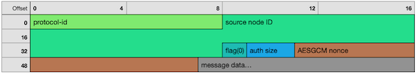
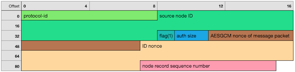

# Node Discovery Protocol v5 - Wire Protocol

**Protocol version v5.1**

This document specifies the wire protocol of Node Discovery v5.

## Notation

Here we present the notation that is used throughout this document.

`[ .. , .. , .. ]`\
    is recursive encoding as an RLP list\
`a || b`\
    means binary concatenation of `a` and `b`\
`xor(a, b)`\
    means binary XOR of `a` and `b`\
`sha256(x)`\
    is the SHA256 digest of `x`\
`aesctr_encrypt(key, iv, pt)`\
    is unauthenticated AES/CTR symmetric encryption with the given `key` and `iv`.\
    Size of `key` and `iv` is 16 bytes (AES-128).\
`aesgcm_encrypt(key, nonce, pt, ad)`\
    is AES-GCM encryption/authentication with the given `key`, `nonce` and additional\
    authenticated data `ad`. Size of `key` is 16 bytes (AES-128), size of `nonce` 12 bytes.

## UDP Communication

Node discovery messages are sent as UDP datagrams. Since UDP is a lossy transport, packets
may be received in any order or not at all. Implementations should not re-send packets if
the recipient doesn't respond.

The maximum size of any packet is 1280 bytes. Implementations should not generate or
process packets larger than this size. Most messages are smaller than this limit by
definition, the exception being the NODES message. FINDNODE returns up to 16 records, plus
other data, and TOPICQUERY may also distribute a significantly long list of ENRs. As per
specification the maximum size of an ENR is 300 bytes. A NODES message containing all
FINDNODE response records would be at least 4800 bytes, not including additional data such
as the header. To stay below the size limit, NODES responses are sent as multiple messages
and specify the total number of responses in the message.

The minimum size of any Discovery v5 packet is 63 bytes. Implementations should reject
packets smaller than this size.

Since low-latency communication is expected, implementations should place short timeouts
on request/response interactions. Good timeout values are 500ms for a single
request/response and 1s for the handshake.

When responding to a request, the response should be sent to the UDP envelope address of
the request.

## Packet Encoding

The protocol deals with three distinct kinds of packets:

- Ordinary message packets, which carry an encrypted/authenticated message.
- WHOAREYOU packets, which are sent when the recipient of an ordinary message packet
  cannot decrypt/authenticate the packet's message.
- Handshake message packets, which are sent following WHOAREYOU. These packets establish a
  new session and carry handshake-related data in addition to the encrypted/authenticated
  message.

In the following definitions, we assume that the sender of a packet has knowledge of its
own 256-bit node ID (`src-id`) and the node ID of the packet destination (`dest-id`). When
sending any packet except WHOAREYOU, the sender also generates a unique 96-bit `nonce`
value.

### Protocol Header

All discovery packets contain a header followed by an optional encrypted and authenticated
message.

Header information is 'masked' using symmetric encryption in order to avoid static
identification of the protocol by firewalls.

    packet        = masking-iv || masked-header || message
    masked-header = aesctr_encrypt(masking-key, masking-iv, header)
    masking-key   = dest-id[:16]
    masking-iv    = uint128   -- random data unique to packet

The `masked-header` contains the actual packet header, which starts with a fixed-size
`static-header`, followed by a variable-length `authdata` section (of size `authdata-size`).

    header        = static-header || authdata
    static-header = protocol-id || version || flag || nonce || authdata-size
    protocol-id   = "discv5"
    version       = 0x0001
    authdata-size = uint16    -- byte length of authdata
    flag          = uint8     -- packet type identifier
    nonce         = uint96    -- nonce of message

Decrypting the masked header data works as follows: The recipient constructs an AES/CTR
stream cipher using its own node ID (`dest-id`) as the key and taking the IV from the
packet. It can then decrypt the `static-header` and verify that `protocol-id` matches the
expected string. If it does, the recipient can read `authdata-size` and unmask the
remaining `authdata`.

Implementations should not respond to packets with mismatching `protocol-id`.

In ordinary message packets and handshake message packets, the packet contains an
authenticated message after the `authdata` section. For WHOAREYOU packets, the `message`
is empty. Implementations must generate a unique `nonce` value for every message packet.

    message       = aesgcm_encrypt(initiator-key, nonce, message-pt, message-ad)
    message-pt    = message-type || message-data
    message-ad    = masking-iv || header

The `flag` field of the header identifies the kind of packet and determines the encoding
of `authdata`, which differs depending on the packet type.

### Ordinary Message Packet (`flag = 0`)

For message packets, the `authdata` section is just the source node ID.

    authdata      = src-id
    authdata-size = 32

### WHOAREYOU Packet (`flag = 1`)

In WHOAREYOU packets, the `authdata` section contains information for the identity
verification procedure. The `message` part of WHOAREYOU packets is always empty. The
`nonce` part of the packet must be set to the `nonce` of the message packet that caused
the WHOAREYOU response.

    authdata      = id-nonce || enr-seq
    authdata-size = 24
    id-nonce      = uint128   -- random bytes
    enr-seq       = uint64    -- ENR sequence number of the requesting node

### Handshake Message Packet (`flag = 2`)

For handshake message packets, the `authdata` section has variable size since public key
and signature sizes depend on the ENR identity scheme. For the "v4" identity scheme, we
assume 64-byte signature size and 33 bytes of (compressed) public key size.

`authdata` starts with a fixed-size `authdata-head` component, followed by the ID
signature, ephemeral public key and optional node record.

The `record` field may be omitted if the `enr-seq` of WHOAREYOU is recent enough, i.e.
when it matches the current sequence number of the sending node. If `enr-seq` is zero, the
record must be sent. Node records are encoded and verified as specified in [EIP-778].

Please refer to the [handshake section] for more information about the content of the
handshake packet.

    authdata      = authdata-head || id-signature || eph-pubkey || record
    authdata-head = src-id || sig-size || eph-key-size
    authdata-size = 34 + sig-size + eph-key-size + len(record)
    sig-size      = uint8     -- value: 64 for ID scheme "v4"
    eph-key-size  = uint8     -- value: 33 for ID scheme "v4"

## Protocol Messages

This section lists all defined messages which can be sent and received. The hexadecimal
value in parentheses is the `message-type`.

The first element of every `message-data` list is the request ID. `request-id` is an RLP
byte array of length <= 8 bytes. For requests, this value is assigned by the requester.
The recipient of a message must mirror the value in the `request-id` element of the
response. The selection of appropriate values for request IDs is left to the implementation.

### PING Request (0x01)

    message-data = [request-id, enr-seq]
    message-type = 0x01
    enr-seq      = local ENR sequence number of sender

PING checks whether the recipient is alive and informs it about the sender's ENR sequence
number.

### PONG Response (0x02)

    message-data   = [request-id, enr-seq, recipient-ip, recipient-port]
    message-type   = 0x02
    enr-seq        = ENR sequence number of sender
    recipient-ip   = 16 or 4 byte IP address of the intended recipient
    recipient-port = recipient UDP port, a 16-bit integer

PONG is the reply to PING.

### FINDNODE Request (0x03)

    message-data = [request-id, [distance₁, distance₂, ..., distanceₙ]]
    message-type = 0x03
    distanceₙ    = requested log2 distance, a positive integer

FINDNODE queries for nodes at the given logarithmic distances from the recipient's node
ID. When distance `0` is requested, the result set should contain the recipient's current
record.

The recipient should create the result set by collecting nodes from its local node table
according to the requested distances. Implementations should limit the number of nodes in
the result set. The recommended result limit for FINDNODE queries is 16 nodes.

### NODES Response (0x04)

    message-data = [request-id, total, [ENR, ...]]
    message-type = 0x04
    total        = total number of responses to the request

NODES is the response to a FINDNODE or TOPICQUERY message. Multiple NODES messages may be
sent as responses to a single query. Implementations may place a limit on the allowed
maximum for `total`. If exceeded, additional responses may be ignored.

When handling NODES as a response to FINDNODE, the recipient should verify that the
received nodes match the requested distances.

### TALKREQ Request (0x05)

    message-data = [request-id, protocol, request]
    message-type = 0x05

TALKREQ sends an application-level request. The purpose of this message is pre-negotiating
connections made through another application-specific protocol identified by `protocol`.
`protocol` and `request` are RLP byte arrays.

The recipient must respond with a TALKRESP message containing the response to the request.
If the `protocol` is unknown to the recipient, it must respond with a TALKRESP response
containing empty `response` data.

### TALKRESP Response (0x06)

    message-data = [request-id, response]
    message-type = 0x06
    request-id   = request-id of TALKREQ

TALKRESP is the response to TALKREQ. The `response` is a RLP byte array containing the
response data.

### REGTOPIC Request (0x07)

**NOTE: the content and semantics of this message are not final.**
**Implementations should not respond to or send these messages.**

    message-data = [request-id, topic, ENR, ticket]
    message-type = 0x07
    node-record  = current node record of sender
    ticket       = byte array containing ticket content

REGTOPIC attempts to register the sender for the given topic. If the requesting node has a
ticket from a previous registration attempt, it must present the ticket. Otherwise
`ticket` is the empty byte array (RLP: `0x80`). The ticket must be valid and its waiting
time must have elapsed before using the ticket.

REGTOPIC is always answered by a TICKET response. The requesting node may also receive a
REGCONFIRMATION response when registration is successful. It may take up to 10s for the
confirmation to be sent.

### TICKET Response (0x08)

**NOTE: the content and semantics of this message are not final.**
**Implementations should not respond to or send these messages.**

    message-data = [request-id, ticket, wait-time]
    message-type = 0x08
    ticket       = an opaque byte array representing the ticket
    wait-time    = time to wait before registering, in seconds

TICKET is the response to REGTOPIC. It contains a ticket which can be used to register for
the requested topic after `wait-time` has elapsed. See the [theory section on tickets] for
more information.

### REGCONFIRMATION Response (0x09)

**NOTE: the content and semantics of this message are not final.**
**Implementations should not respond to or send these messages.**

    message-data = [request-id, topic]
    message-type = 0x09
    request-id   = request-id of REGTOPIC

REGCONFIRMATION notifies the recipient about a successful registration for the given
topic. This call is sent by the advertisement medium after the time window for
registration has elapsed on a topic queue.

### TOPICQUERY Request (0x0A)

**NOTE: the content and semantics of this message are not final.**
**Implementations should not respond to or send these messages.**

    message-data = [request-id, topic]
    message-type = 0x0a
    topic        = 32-byte topic hash

TOPICQUERY requests nodes in the [topic queue] of the given topic. The recipient of this
request must send one or more NODES messages containing node records registered for the
topic.

## Test Vectors

A collection of test vectors for this specification can be found at
[discv5 wire test vectors].

[handshake section]: ./discv5-theory.md#handshake-steps
[topic queue]: ./discv5-theory.md#topic-table
[theory section on tickets]: ./discv5-theory.md#tickets
[EIP-778]: ../enr.md
[discv5 wire test vectors]: ./discv5-wire-test-vectors.md
